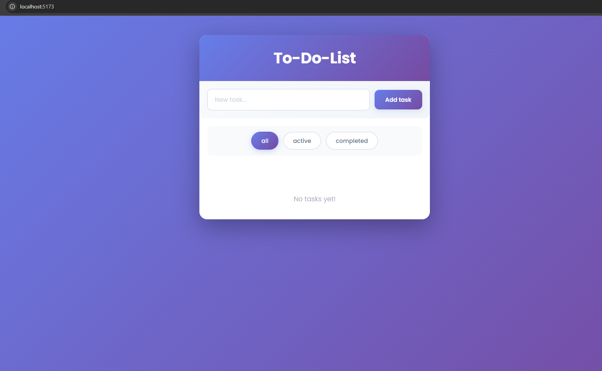

# 📝 Vue To-Do List

A beautiful, modern to-do list application built with **Vue 3** and **Vite** featuring an attractive UI with smooth animations and a responsive design.



## ✨ Features

- ✅ **Add Tasks** - Create new tasks with a simple input
- 🎯 **Filter Tasks** - View all, active, or completed tasks
- ✏️ **Edit Tasks** - Double-click to edit task text
- 🗑️ **Delete Tasks** - Remove tasks you no longer need
- 💾 **Persistent Storage** - Tasks are saved to localStorage
- 🎨 **Modern Styling** - Beautiful gradient design with smooth animations
- 📱 **Responsive Design** - Works on desktop and mobile devices

## 🛠️ Tech Stack

- **Vue 3** - Frontend framework
- **Vite** - Build tool and dev server
- **JavaScript** - Programming language
- **CSS3** - Styling with gradients and animations
- **Poppins Font** - Google Fonts for modern typography

## 📦 Installation

1. Clone the repository:

   ```bash
   git clone https://github.com/PCostaaa/To-Do-List_Vue.git
   cd todo-vue
   ```

2. Install dependencies:
   ```bash
   npm install
   ```

## 🚀 Usage

### Development Server

```bash
npm run dev
```

The app will be available at `http://localhost:5173/`

### Build for Production

```bash
npm run build
```

### Preview Production Build

```bash
npm run preview
```

## 📂 Project Structure

```
todo-vue/
├── src/
│   ├── components/
│   │   ├── TaskInput.vue    # Task creation component
│   │   └── TaskItem.vue     # Individual task component
│   ├── App.vue              # Main app component
│   └── main.js              # Entry point
├── index.html               # HTML template
├── package.json             # Project dependencies
├── vite.config.js           # Vite configuration
└── README.md                # This file
```

## 🎯 How to Use

1. **Add a Task**: Type in the input field and press Enter or click "Add task"
2. **Mark Complete**: Click on a task to toggle it as complete
3. **Edit a Task**: Double-click on a task text to edit it
4. **Delete a Task**: Click the "Delete" button
5. **Filter Tasks**: Use the filter buttons to show All, Active, or Completed tasks

## 💾 Data Persistence

All tasks are automatically saved to your browser's **localStorage**, so they persist even after closing the browser.

## 🎨 Customization

You can customize the styling by editing the `<style>` sections in:

- `src/App.vue` - Main container and filters styling
- `src/components/TaskInput.vue` - Input area styling
- `src/components/TaskItem.vue` - Task item styling

Colors used:

- Primary Gradient: `#667eea` → `#764ba2`
- Background: Light grays and whites

## 📄 License

This project is open source and available under the MIT License.

## 👨‍💻 Author

**PCostaaa** - Created with Vue 3 and Vite

---

**Happy task managing! 🚀**
